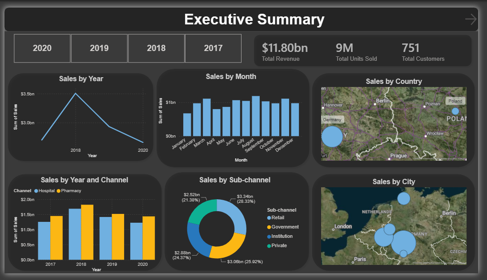
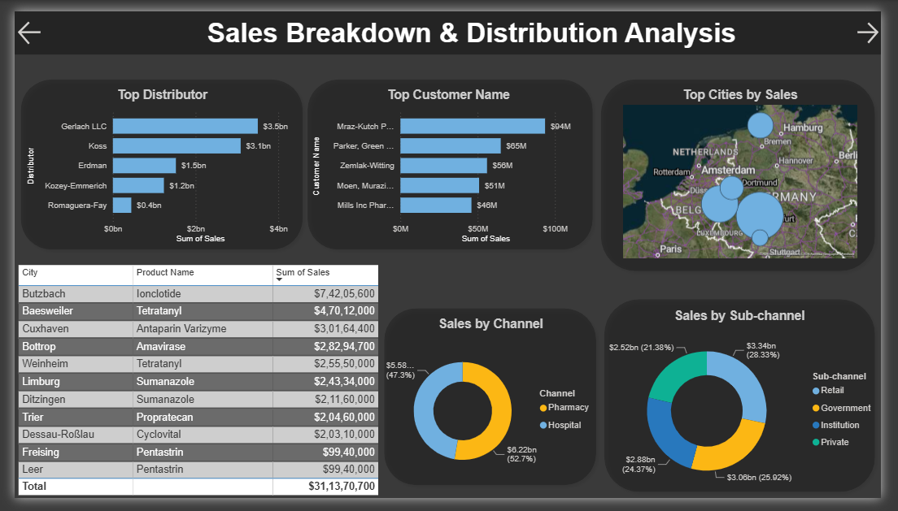
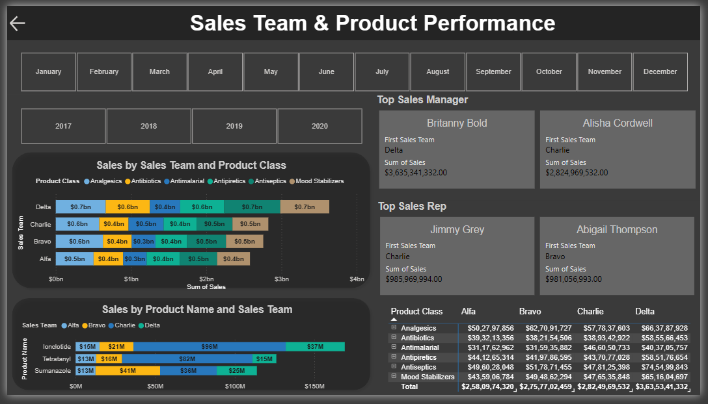

# 📊 Central Europe Pharma Sales Analytics Dashboard

<p align="center">
  
</p>


An end-to-end data analytics project analyzing pharmaceutical sales across Germany and Poland — covering EDA in Python and an interactive multi-page Power BI dashboard.

---

## 🗂️ Project Structure

```
foresight_health/
├── notebooks/
│   └── eda.ipynb                     # EDA & feature engineering
├── data/
│   ├── pharma-data.csv               # Raw dataset
│   ├── channel_sales.csv
│   ├── city_sales.csv
│   ├── class_sales.csv
│   ├── customer_sales.csv
│   ├── customer_segmentation.csv
│   ├── forecast.csv
│   ├── geo_sales.csv
│   ├── monthly_sales.csv
│   ├── product_monthly_sales.csv
│   ├── product_sales.csv
│   ├── product_segmentation.csv
│   ├── rep_performance.csv
│   ├── rep_sales.csv
│   ├── top_dist.csv
│   ├── top_manager.csv
│   ├── top_product_city.csv
│   ├── top_sales_rep.csv
│   └── yearly_sales.csv
├── dashboard/
│   ├── images/
│   └── Foresight_medical.pbix
└── README.md
```

---

## 📌 Objective

Analyze pharmaceutical sales data across Central Europe to surface actionable insights for sales leadership — including rep/manager performance, product-channel mix, distributor efficiency, and geographic distribution.

---

## 🔍 Exploratory Data Analysis (Python)

**Notebook:** `notebooks/eda.ipynb`

### Key analyses performed:

| Analysis | Method |
|---|---|
| KPIs — total revenue, units sold, customers | `df["Sales"].sum()`, `.nunique()` |
| Monthly & yearly sales trend | `groupby(["Year","Month"])` |
| Product class performance ranking | `groupby("Product Class")["Sales"].sum()` |
| Sales rep & manager leaderboard | `groupby("Sales Rep / Manager")` |
| Top product per city | Multi-level sort + `groupby.head(1)` |
| Distributor performance | `groupby("Distributor")["Sales"].sum()` |
| Channel & sub-channel breakdown | `groupby(["Channel","Sub-channel"])` |

### Dataset columns used:
`Sales`, `Quantity`, `Customer Name`, `Product Name`, `Product Class`, `Sales Rep`, `Manager`, `Sales Team`, `City`, `Channel`, `Sub-channel`, `Distributor`, `Year`, `Month`

---

## 📈 Power BI Dashboard

Three-page interactive report with a custom dark theme (Windows 11 aesthetic).


<h2>Executive Summary</h2>

<p align="center">
  
</p>

- KPI cards: **$11.80bn** total revenue · **9M** units sold · **751** customers
- Sales by Year (line chart) — peak in 2018, decline through 2020
- Sales by Month (bar chart) — consistent ~$1bn/month
- Sales by Year & Channel — Hospital vs. Pharmacy split
- Sales by Sub-channel donut — Retail (28.33%), Government (24.37%), Institution (25.92%), Private (21.38%)
- Geographic maps — Sales by Country & Sales by City


<h2>Sales Breakdown & Distribution Analysis</h2>

<p align="center">
  
</p>

- Top 5 Distributors by revenue (Gerlach LLC leads at **$3.5bn**)
- Top 5 Customers by revenue
- Top Cities by Sales (bubble map — Germany focus)
- City × Product drill-down table
- Sales by Channel & Sub-channel donut charts
</p>


<p>
<h2> Sales Team & Product Performance</h2>

<p align="center">
  
</p>

- Month & Year slicers for dynamic filtering
- Sales by Sales Team × Product Class (stacked bar)
- Sales by Product Name × Sales Team (horizontal bar)
- Product Class × Sales Team matrix table
- Top Sales Manager cards — **Britanny Bold** ($3.64bn) & **Alisha Cordwell** ($2.82bn)
- Top Sales Rep cards — **Jimmy Grey** ($985M) & **Abigail Thompson** ($981M)
</p>
---

## 🛠️ Tech Stack

| Tool | Usage |
|---|---|
| Python 3.x | EDA, data wrangling, CSV exports |
| pandas | Aggregations, groupby analysis |
| Jupyter Notebook | Exploratory analysis |
| Power BI Desktop | Interactive dashboard |
| Custom JSON Theme | Dark Windows 11 aesthetic |

---

## 💡 Key Insights

- **Delta** is the highest-performing sales team across all product classes
- **Analgesics** is the top product class by revenue in every team
- **Gerlach LLC** accounts for nearly **30%** of all distributor revenue
- **Hospital channel** (52.7%) slightly outperforms Pharmacy (47.3%)
- Sales peaked in **2018** and declined steadily — warrants further investigation
- **Butzbach** is the top city with Ionclotide as its leading product

---

## 🚀 How to Run

1. Clone the repo and place `pharma-data.csv` inside the `data/` directory
2. Open `notebooks/eda.ipynb` in Jupyter and run all cells
3. Open `dashboard/Foresight_medical.pbix` in Power BI Desktop
4. Refresh data source to point to your local `data/` path

---

## 👤 Author

**Kartikey** · [github.com/Kartikey2203](https://github.com/Kartikey2203)
